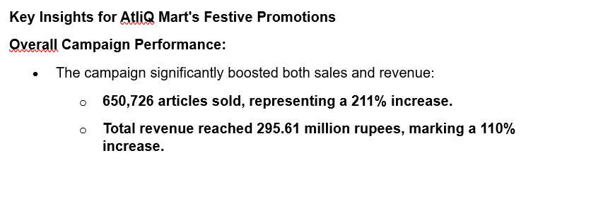
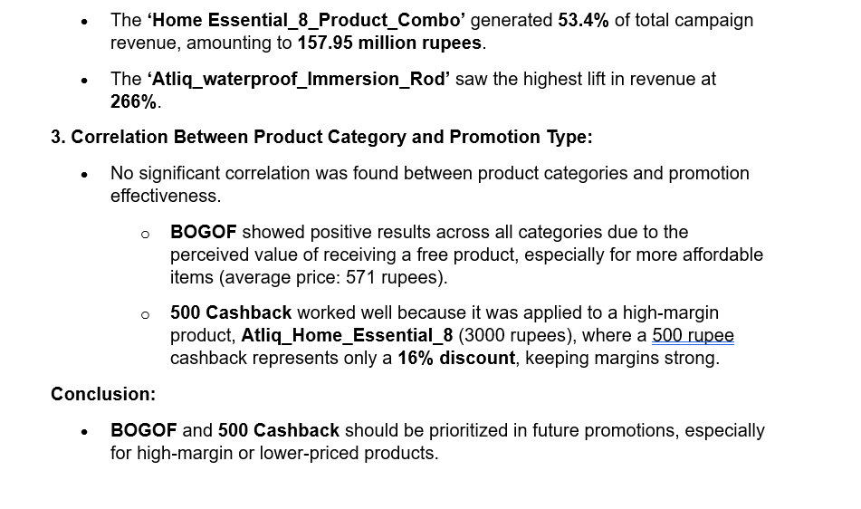
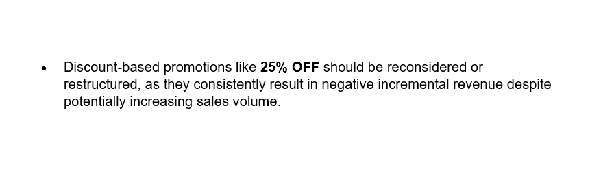
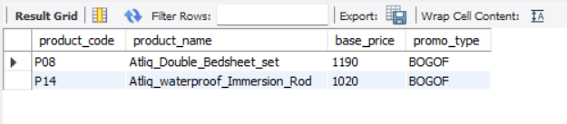
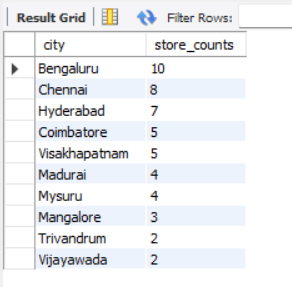
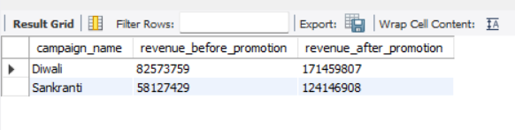
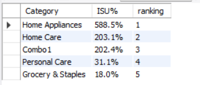
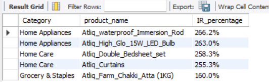

AtliQ Mart is a retail giant with over 50 supermarkets in the southern region of India. All their 50 stores ran a massive promotion during the Diwali 2023 and Sankranti 2024 (festive time in India) on their AtliQ branded products. Now the sales director wants to understand which promotions did well and which did not so that they can make informed decisions for their next promotional period.

![KI](
<noscript></noscript><object class='tableauViz'  style='display:none;'><param name='host_url' value='https%3A%2F%2Fpublic.tableau.com%2F' /> <param name='embed_code_version' value='3' /> <param name='site_root' value='' /><param name='name' value='RC9SalesPromotionsAnalysis&#47;RC9SalesPromotionsAnalysis' /><param name='tabs' value='no' /><param name='toolbar' value='yes' /><param name='static_image' value='https:&#47;&#47;public.tableau.com&#47;static&#47;images&#47;RC&#47;RC9SalesPromotionsAnalysis&#47;RC9SalesPromotionsAnalysis&#47;1.png' /> <param name='animate_transition' value='yes' /><param name='display_static_image' value='yes' /><param name='display_spinner' value='yes' /><param name='display_overlay' value='yes' /><param name='display_count' value='yes' /><param name='language' value='fr-FR' /><param name='filter' value='publish=yes' /></object>
                )

Additionally, the senior executives had important business questions requiring SQL-based report generation.

- SQL Report Insights 

1-	Provide a list of products with a base price greater than 500 rupees and that are featured in the promo type of 'BOGOF' (BUY ONE GET ONE FREE)

This information will help identify high-value products currently being heavily discounted, which can be useful for evaluating item pricing and promotion strategies.

2-	Generate a report that provides an overview of the number of stores in each city.

The results are sorted in descending order of store counts, allowing us to identify the cities with the highest store presence. The report includes two essential fields: city and store count, which will assist in optimizing the retail operations.

3-	Generate a report that displays each campaign along with the total revenue generated before and after the campaign.

 
This report should help in evaluating the financial impact of our promotional campaigns

4-	 Produce a report that calculates the Incremental Sold Quantity (ISU%)  for each category during the Diwali Campaign.

This information will assist in assessing the category-wise success and impact of the Diwali campaign on incremental sales.

5-	Create a report featuring the Top 5 products, ranked by Incremental Revenue Percentage (IR%), across all campaigns.

This analysis helps identify the most successful products in terms of incremental revenue across our campaigns, assisting in product optimization
