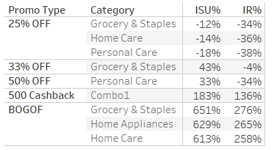

 # Context

AtliQ Mart is a retail giant with over 50 supermarkets in the southern region of India. All their 50 stores ran a massive promotion during the Diwali 2023 and Sankranti 2024 (festive time in India) on their AtliQ branded products. Now the sales director wants to understand which promotions did well and which did not so that they can make informed decisions for their next promotional period.

## Data Structure
Atliq Mart Database consists of four table: dim_campaigns; dim_products; dim_stores; fact_events

The project aims to provide insights on: 

#### • Campaign performance
#### • Promotion Type Performance
#### • Product Category and Product performance

## North Star metrics: 

#### • incremental revenue percentage (IR%)

#### • incremental sold units percentage (ISU%)

#### • campaign revenue

The interactive Tableau Dashboard can be found 

The SQL queries can be found 

## Key insights

### Overall Campaign Performance

Both campaigns significantly boosted both sales and revenue   
 
#### o	650,726 articles sold, representing a 211% increase.
#### o	Total revenue reached 295.61 million rupees, marking a 110% increase.

### Promotion Type Analysis

#### o	BOGOF: 267% increase in revenue and 640% increase in units sold.
#### o	500 Cashback: 136% increase in revenue and 183% increase in units sold.
#### o	Discount-based promotions, such as 25% OFF, consistently generated negative incremental revenue.

                                                   

### The key takeaway is that BOGOF and 500 Cashback offer the best balance between boosting sales volume and maintaining healthy margins.

### Product and Category Analysis:

#### o	The Home Appliances category was the standout performer, with a 629% increase in sales.

#### o	The ‘Home Essential_8_Product_Combo’ generated 53.4% of total campaign revenue, amounting to 157.95 million rupees.
#### o	The ‘Atliq_waterproof_Immersion_Rod’ saw the highest lift in revenue at 266%.

### Why some promotions types are more successful?
The original question from the Sales Team was: 
#### Is there a correlation between product category and promotion type effectiveness?

The answer to this question led me to understand why some promotions succeeded better than others during the campaigns.

As we can see from the table above, BOGOF and 25% OFF discount have opposites performance. No matter the product category, BOGOF succeed to give positive performance in incremental sales or revenue. 
There is no significant correlation between the product category and promotion type effectiveness. 

#### o	The BOGOF CASE
The BOGOF is very effective on incremental revenue because of how it works. Buy One, Get One means the customer pays a product at full price and receives a second free. In the transaction, the store keeps 100% of the money. 

*second reason
 products that are listed under this promotion are more affordable. The average price for products listed under BOGOF is 571 rupees. 
 
*last reason but not least: there is a gift for every purchase. Customers receive two products for the same price which they perceive as a good deal.

Those two last conditions make the products so much more attractive to the customers, leading to more units sold. 

More units sold generate more revenue and since the store keeps  100% of the money, that results in a higher incremental revenue percentage.  

#### o	The 500 Cashback CASE

The performance of the 500 Cashback promotion is explained by one thing.

The product it was applied to. Especially, the product's price
 
This is the (Atliq_Home_Essential_8) listed at 3000 rupees. 
With a 500 Cashback, it's only a 16% discount, keeping margins strong.

Here is a correlation. The results could be different if the base price was lower or if the cashback amount was higher. 

#### o	The 50% OFF CASE

50% OFF is appealing to customers. It drives sales UP but it is almost impossible to have a positive incremental revenue when the price is cut in half.

#### The key takeaway is the promotion type effectiveness is multifactorial. 

### Recommendations 

#### o	BOGOF and 500 Cashback should be prioritized in future promotions, especially for high-margin or lower-priced products.
#### o	Discount-based promotions like 25% OFF should be reconsidered or restructured, as they consistently result in negative incremental revenue despite potentially increasing sales volume.

Additionally, the senior executives had important business questions requiring SQL-based report generation.

### SQL Report Insights 

1-	Provide a list of products with a base price greater than 500 rupees and that are featured in the promo type of 'BOGOF' (BUY ONE GET ONE FREE)

#### This information will help identify high-value products currently being heavily discounted, which can be useful for evaluating item pricing and promotion strategies.

2-	Generate a report that provides an overview of the number of stores in each city.

#### The results are sorted in descending order of store counts, allowing us to identify the cities with the highest store presence. The report includes two essential fields: city and store count, which will assist in optimizing the retail operations.

3-	Generate a report that displays each campaign along with the total revenue generated before and after the campaign.

 
#### This report should help in evaluating the financial impact of our promotional campaigns

4-	 Produce a report that calculates the Incremental Sold Quantity (ISU%)  for each category during the Diwali Campaign.

#### This information will assist in assessing the category-wise success and impact of the Diwali campaign on incremental sales.

5-	Create a report featuring the Top 5 products, ranked by Incremental Revenue Percentage (IR%), across all campaigns.

#### This analysis helps identify the most successful products in terms of incremental revenue across our campaigns, assisting in product optimization
